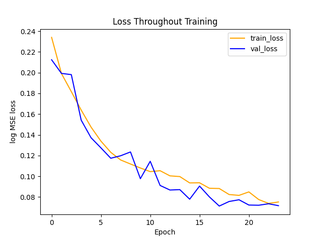
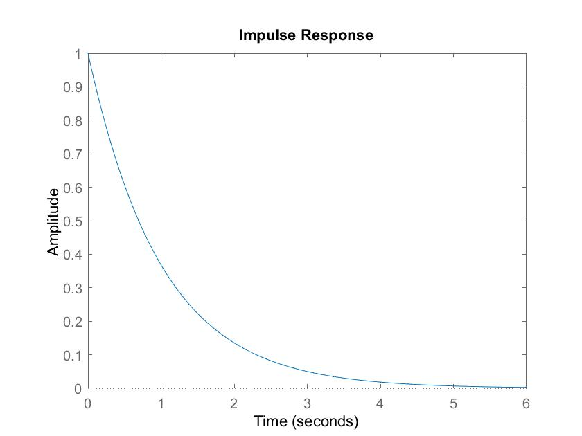
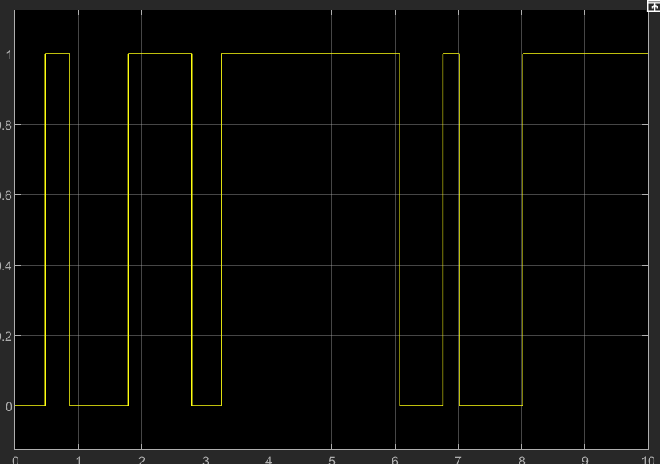
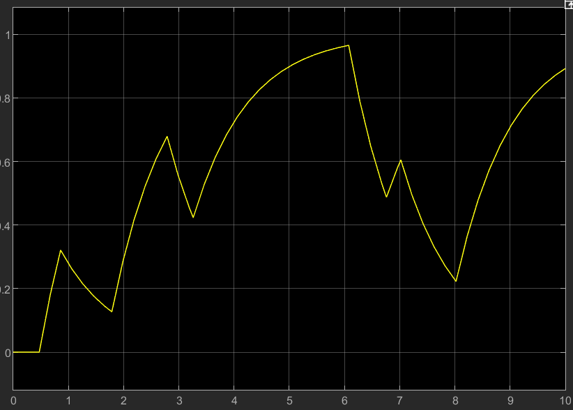

# LiNet

LiNet is a neural net architecture that replaces the weights of a standard feed-forward network with linear transfer functions. This allows the network to efficiently operate on online time-series data more efficiently than existing convolutional approaches, and train more efficiently than existing recurrent approaches.

## Information

The CUDA/C++ optimized version of the network is still a work in progress, so all usable code is currently found in the /py folder.

### linet.py

Defines the LiNet class and contains teh methods for forward and backwards propogation, as well as other useful methods and information.

### linet_helpers.py

Defines constants and helper functions for the LiNet class and other files.

### train.py

Defines the train function, which allows the user to plug in an instance of the DataLoader class (also defined in this file) and perform gradient descent with variable batch size. The train function provides both checkpointing and loss-graphing functionality.

### main.py

Currently serves as an example of training the network to classify sinusoidal functions from simply polynomial functions, described below.

## Example

Using a network with the following parameters:
 - num_hidden = 4
 - num_steps = 64
 - default constants seen in linet.py
 - elu activation function

and training/data with the following parameters:
 - num_steps = 64
 - classifier = true
 - batch_size = 1
 - n_train = 64 of each type
 - n_val = 16 of each type
 - learning_rate = 1e-4

to classify between 2nd-order polynomials:

and sinusoidal waves:

the mean-squared error (given a sigmoidal activation on the last layer, with a 1 label representing a sinusoid and a 0 representing a polynomial) on both the training sets and the validation sets can be seen converging (note that this graph shows mean MSE loss, not log MSE loss):

This is obviously a small and simple example, but it shows that the network is able to learn non-arbitrary tasks. As progress continues I hope to create a much more impressive example. 
 

## TODO:
 1. Fix activation function on output layer of network (currently worked around in training function)
 2. Implement parallel batches in backwards pass.
 3. Add option for bias value in transfer function layers.
 4. Add option to regularize gain and gamma weights.
 5. Modularize the network to allow more configurable layer sizes, activation functions, and mix in other types of layers.
 6. Use imaginary axis to implement double-pole transfer functions.
 7. Add feedback/long-term-memory connections to generalize away from feed-forward convolution.

## Theory

Linear transfer functions are come from the field of control theory, and are abstractions of real world systems. The most simple transfer function is DC-gain, which only multiplies the input by some constant to get the output (in the context of deep learning, this represents regular 'weights' used in feed-forward networks). The next step up in complexity is what LiNet currently uses: the single-pole transfer function.

The single-pole transfer function is the solution to the dynamics equation x' + ax = F. Systems described by this equation include the charge of a transistor with relation to voltage, and the velocity of an object moving with viscous friction with relation to driving force.

Represented in the s-domain as k/(s-p), the single-pole transfer function represents the convolution of the input signal (often a force or a voltage, but in our case the input to a layer) with an exponential decay response function. It can be shown that through linear combinations of single-poly transfer functions, any arbitrary response function can be achieved. 

Example response function:

### Example of signal convolution:

Input:

Output:

With respect to deep learning, transfer functions are more computationally efficient than kernel-based approaches, as the next state of a transfer function can be found using one multiply-accumulate: y(t) = k*exp(p)*y(t-1) + x(t), where k*exp(p) must only be computed once. Furthermore, since previous inputs are stored in superposition, only the current state of the network must be stored during inference - that is, we don't need to store previous states to re-convolve over them. This mean that LiNet has the exact same time and space inference complexity as a regular feed-forward network.

